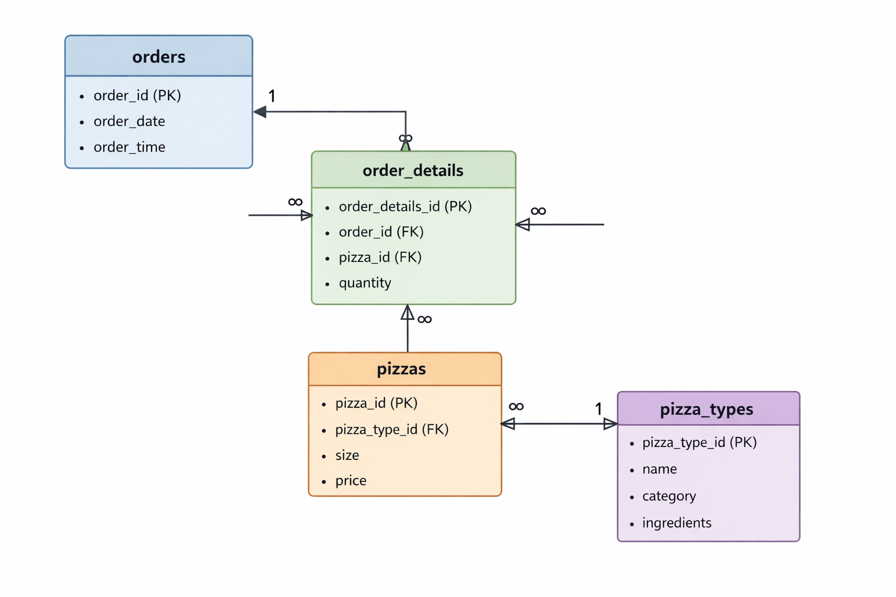

# Pizza Sales Analytics & Business Insights (SQL Project) 
## Table of content
- [Overview](https://github.com/Jk1201-web/Pizza-Sales-Analysis-using-SQL#overview)
- [Objective](https://github.com/Jk1201-web/Pizza-Sales-Analysis-using-SQL#objectives)
- [Dataset](https://github.com/Jk1201-web/Pizza-Sales-Analysis-using-SQL#dataset)
- [ER Diagram](https://github.com/Jk1201-web/Pizza-Sales-Analysis-using-SQL/tree/main#er-diagrampng)
- [Problem statement](https://github.com/Jk1201-web/Pizza-Sales-Analysis-using-SQL#problem-statement)
- [Tools & skills](https://github.com/Jk1201-web/Pizza-Sales-Analysis-using-SQL#tools--skills-used)
- [SQL techniques](https://github.com/Jk1201-web/Pizza-Sales-Analysis-using-SQL#sql-techniques-used)
- [Key matrics](https://github.com/Jk1201-web/Pizza-Sales-Analysis-using-SQL#key-metrics)
- [Key insight](https://github.com/Jk1201-web/Pizza-Sales-Analysis-using-SQL#key-insights)
- [How to run project](https://github.com/Jk1201-web/Pizza-Sales-Analysis-using-SQL#how-to-run)
- [Project workflow](https://github.com/Jk1201-web/Pizza-Sales-Analysis-using-SQL#project-workflow)
- [Sample SQL query](https://github.com/Jk1201-web/Pizza-Sales-Analysis-using-SQL#sample-sql-query)
- [Project structure](https://github.com/Jk1201-web/Pizza-Sales-Analysis-using-SQL#project-structure)
- [Connect with me](https://github.com/Jk1201-web/Pizza-Sales-Analysis-using-SQL#connect-with-me)
     - [LinkedIn](www.linkedin.com/in/jijau-khandale)
     - [GitHub](https://github.com/Jk1201-web)
     - [Kaggle](https://www.kaggle.com/jijaumohankhandale)

## Overview
This project performs an in-depth analysis of a pizza sales dataset to extract **actionable business insights** using **MySQL**.
It demonstrates real-world data analyst skills including **data cleaning, transformation, KPI analysis, and trend discovery**.

## Objectives
- Analyze overall business performance
- Identify top-selling and high-revenue products
- Understand customer ordering patterns
- Detect peak sales days and hours
- Perform category-level and time-based analysis
  
## Dataset
The dataset consists of multiple relational tables
[Dataset used in this project-pizza_sales.zip](pizza_sales.zip)

## Entity Relationship Diagram
- The dataset follows a relational structure where:
1. `order_details` acts as a bridge between `orders` and `pizzas`
2. `pizzas` is linked to `pizza_types` for category-level insights
- 

## Problem Statement
#### The business wants to understand:
1.  Which products drive the most revenue?
2.  When are peak sales periods?
3.  How customers behave in ordering?
4.  Which categories perform best?
   
## Tools & Skills Used
- MySQL
- Data Analysis
- Business Insight Generation
  
### SQL Techniques Used

| Category | Concepts |
|------|------|
| Data Retrieval | SELECT, WHERE |
| Joins	| INNER JOIN (3+ tables) |
| Aggregation |	SUM, COUNT, AVG |
| Grouping | GROUP BY, HAVING |
| Advanced | Window Functions (RANK, SUM OVER) |
| Optimization | Subqueries |

## Key Metrics

| Matrics | Values |
|------|------|
| Total Orders | `21,350` |
| Total Revenue |	`₹817,860` |
| Total Pizzas | `Sold 49,574` |
| Average Order Value |	`₹38.3` |
| Total Categories | `4` |

## Key Insights
### Product Insights
- Top revenue-generating pizza: **Thai Chicken Pizza (~₹43K)**
- Top 3 pizzas are all chicken-based, indicating strong customer preference
- Revenue is concentrated among a few high-performing products
### Category Insights
- **Classic category** generated the **highest revenue (~₹220K)**
- Balanced revenue contribution across all categories
### Time-Based Insights
- Peak hours: **12 PM – 2 PM** (Lunch) & **5 PM – 8 PM** (Evening)
- Highest daily orders reached 115 **(≈2x average demand)**
- Early mornings and late nights show lower activity
### Revenue Trend Analysis
- Used **window functions** to calculate cumulative revenue (running total)
- Observed **steady business growth** with periodic spikes
- Highest daily revenue exceeded **₹4,400**

## Business Recommendations
1. Focus marketing campaigns on high-performing chicken pizzas to maximize revenue
2. Increase staffing and inventory during peak hours to improve efficiency
3. Introduce promotions or combos for low-performing products
4. Optimize stock planning based on category demand trends
  
## How to Run
1. Import dataset into MySQL / PostgreSQL
   - Dataset consists of multiple tables
     1. [order_details](order_details.csv)
     2. [orders](orders.csv)
     3. [pizzas](pizzas.csv)
     4. [pizza_types](pizza_types.csv)
2. Run SQL queries step-by-step
   - [Follow this file for SQL queries](pizza_sales.sql)
3. Analyze results and derive insights
   
## Project Workflow
1. **Data Collection**
   - Downloaded pizza sales dataset  
   - Identified multiple related tables  

2. **Data Import**  
   - Imported CSV files into SQL database  
   - Created tables (orders, order_details, pizzas, pizza_types)

3. **Data Cleaning**  
   - Checked for missing values  
   - Fixed data types and column formats  

4. **Data Understanding**  
   - Explored table relationships  
   - Verified primary and foreign keys

5. **Data Analysis (SQL)**  
   - Used JOINs to combine tables  
   - Applied aggregations (SUM, COUNT, AVG)  
   - Calculated KPIs (Revenue, Orders, AOV)  

6. **Advanced Analysis**  
   - Used window functions (RANK, SUM OVER)  
   - Identified top pizzas per category  
   - Analyzed running revenue trends

7. **Business Insights**  
   - Found top-performing products  
   - Identified peak hours and days  
   - Analyzed category-wise performance  

8. **Result Presentation**  
   - Structured insights for business understanding  
   - Prepared GitHub README documentation
     
## Sample SQL Query

```
- 3] Category contributed highest revenue

SELECT 
      pt.category,
      SUM(od.quantity * p.price) AS Revenue
FROM pizza_types pt
JOIN pizzas p 
ON pt.pizza_type_id = p.pizza_type_id
JOIN order_details od
ON od.pizza_id = p.pizza_id
GROUP BY category
ORDER BY Revenue DESC 
LIMIT 1;

```
## Project Structure
```
Pizza-Sales-Analysis-using-SQL
 ┣ SQL/
 ┃ ┗ pizza_analysis.sql
 ┣ Dataset/
 ┃ ┣ orders.csv
 ┃ ┣ order_details.csv
 ┃ ┣ pizzas.csv
 ┃ ┗ pizza_types.csv
 ┣ Docs/
 ┃ ┗ insights.md
 ┗ README.md
 ```
## Connect With Me
 - [LinkedIn](www.linkedin.com/in/jijau-khandale)
 - [GitHub](https://github.com/Jk1201-web)
 - [Kaggle](https://www.kaggle.com/jijaumohankhandale)

*If you found this project useful, consider giving it a star!*


  
